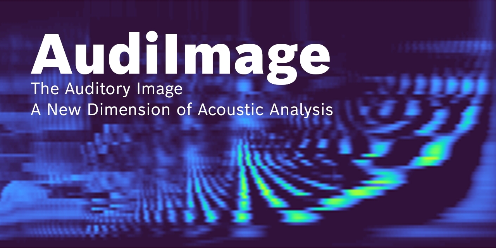
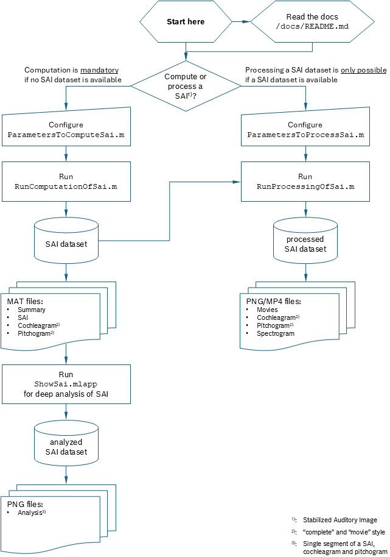

# AudiImage

[![License: Apache 2.0][license-badge]][license-text]

AudiImage is an Open Source Project which delivers a new dimension in acoustic
analysis, especially when human hearing is to be mimicked and when machine
hearing is to be performed. This repository is a modified version of the
[CARFAC][carfac-project] project. Especially the SAI (Stabilized Auditory Image)
implementation is in focus, the CARFAC (Cascade of Asymmetric Resonators with
Fast-Acting Compression) itself is unchanged. For more information about
Auditory Images have a look on [our
paper][kuka-fischer-link][^kuka-fischer-reference] for a brief overview or get
in touch with Richard F. Lyon's textbook ["Human and Machine Hearing: Extracting
Meaning from Sound"][hmh-doi][^hmh-reference][^dicks-homepage], where chapter 21
gives you a comprehensive explanation and description.

## Table of Contents <!-- omit in toc -->
<!-- TOC -->

- [AudiImage](#audiimage)
  - [Getting Started](#getting-started)
    - [Quick start](#quick-start)
    - [Requirements](#requirements)
  - [Contribution Guidelines](#contribution-guidelines)
  - [About](#about)
    - [Maintainers](#maintainers)
    - [CARFAC](#carfac)
    - [Used Encryption](#used-encryption)
    - [License](#license)

<!-- /TOC -->

## Getting Started

In the root folder, you can find the starter scripts, which serve as the entry
point to AudiImage:
* `RunComputationOfSai.m` to easily run a computation of a SAI (get summary and
  data MAT files; **mandatory to run first**, if no SAI dataset is available)
* `RunProcessingOfSai.m` to run a (re-)processing of an existing SAI dataset
  (get movie, "grams", ...)
* `ShowSai.mlapp` is an interactive MATLAB App to analyze an existing SAI dataset
* For the above listed scripts there are associated parameter files, which are
  **mandatory** to configure before running the scripts. The files are called
  `ParametersToComputeSai.m`, `ParametersToProcessSai.m` and
  `ParametersToShowSai.m`.

In `script` and `helper` folder you can find core and helper functions to run
the computation and processing of SAI datasets.

In `matlab` folder you can find the MATLAB implementation of the CARFAC model
and the modified SAI implementation.

The `resources` folder primarily contains image files used to enhance the
appearance of markdown files.

The `docs` folder includes more detailed [documentation](docs/README.md) on how
to use AudiImage.

### Quick start

### Requirements

- MATLAB without any toolboxes
- [FFmpeg][ffmpeg-homepage][^ffmpeg]
- optional[^spectrogram]: MATLAB with Signal Processing Toolbox for
  `spectrogram` function

## Contribution Guidelines

Please read [our contribution guidelines](CONTRIBUTING.md).

## About

### Maintainers

* [Michael Kuka][michael-kuka-github] (<michael.kuka@de.bosch.com>)

### CARFAC

> This section is taken from the original README.md with slight modifications to
> fit to this fork.

The CAR-FAC (cascade of asymmetric resonators with fast-acting compression) is a
cochlear model implemented as an efficient sound processor, for mono, stereo, or
multi-channel sound inputs.

This package includes the MATLAB implementations of the CARFAC model as well as
code for computing Stabilized Auditory Image (SAI).

See the [design doc](docs/CARFAC_Design_Doc.txt) for a more detailed discussion
of the software design.

### Used Encryption

This repository does not contain or use encryption algorithms.

### License

AudiImage is open-sourced under the Apache-2.0 license. See the
[LICENSE](LICENSE) file for details.

For a list of other open source components included in AudiImage, see the
file [3rd-party-licenses.txt](3rd-party-licenses.txt).

<!-- Link shorteners and footnotes -->

[license-text]: https://opensource.org/licenses/Apache-2.0
[license-badge]: https://img.shields.io/badge/License-Apache_2.0-blue.svg
[carfac-project]: https://github.com/google/carfac
[kuka-fischer-link]: https://pub.dega-akustik.de/DAGA_2024/files/upload/paper/44.pdf
[hmh-doi]: https://doi.org/10.1017/9781139051699
[ffmpeg-homepage]: https://ffmpeg.org/
[michael-kuka-github]: https://github.com/b0sch-mike

[^kuka-fischer-reference]: M. Kuka and M. Fischer, “Hearing Equivalent Signal Analysis by Auditory Images in Industrial Applications,” in Fortschritte der Akustik - DAGA 2024, Hannover, Mar. 2024, pp. 1218–1221. [Online]. Available: https://pub.dega-akustik.de/DAGA_2024/files/upload/paper/44.pdf

[^hmh-reference]: R. F. Lyon, *Human and Machine Hearing: Extracting Meaning from Sound.* Cambridge: Cambridge University Press, 2017. doi: 10.1017/9781139051699.

[^dicks-homepage]: [Richard F. Lyon's homepage](http://dicklyon.com/), [the textbook's homepage](http://www.machinehearing.org/) and find [here](http://dicklyon.com/hmh/) the author‘s draft of the textbook.

[^spectrogram]: When you set the processing option `processOptions.isProcessSpectrogram = false` then you can run AudiImage with only the MATLAB Base License.

[^ffmpeg]: Adjust the `PATH_TO_FFmpeg` in `matlab/MakeMovieFromPngsAndWav.m` to match your specific installation.