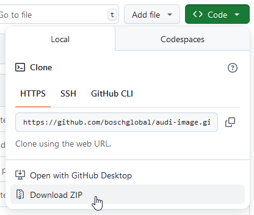

# Notes on Installation & Update of AudiImage <!-- omit in toc -->

## Table of Contents <!-- omit in toc -->
<!-- TOC -->

- [Installation](#installation)
  - [When you experienced with `git`](#when-you-experienced-with-git)
    - [First time installation](#first-time-installation)
    - [Update](#update)
  - [`git`? WTH! Gimme something to understand!](#git-wth-gimme-something-to-understand)
    - [First time installation](#first-time-installation-1)
    - [Update](#update-1)

<!-- /TOC -->


## Installation

> Don't experienced with `git`? Don't give up! Move directly to [installation
> and update routine w/o `git`](#git-wth-gimme-something-to-understand).

### When you experienced with `git`

> **Requirement:** You must have `git` installed on your machine.

#### First time installation

1.  Move to a folder where you want to clone AudiImage in:
    ```bash
    cd folder/for/AudiImage
    ```

2.  And then just clone AudiImage repo:
    ```bash
    git clone https://github.com/boschglobal/audi-image.git
    ```

3.  You should get something like this:
    ```
    folder/for/AudiImage/audi-image
    ```

#### Update

> **Warning:** This will discard your local changes! When you only use AudiImage
> in daily business then it will reset mainly the parameter files, which might
> be not that bad. Otherwise, below is shown an alternative method how to save
> your local modifications.

**Steps to update your local repo ignoring local changes:**

1.  Move to the folder where AudiImage code is located:
    ```bash
    cd folder/for/AudiImage/audi-image
    ```

2.  Fetch the latest changes from remote:   
    ```bash
    git fetch
    ```
    
3.  Reset your local branch to the remote branch, discarding local changes:
    ```bash
    git reset --hard origin/master
    ```

**Alternative: If you want to keep local changes but not commit them, and still
               update:**

Git does not support ignoring local changes automatically during pull because it
tries to merge changes. But you can stash your changes temporarily:

1.  Move to the folder where AudiImage code is located:
    ```bash
    cd folder/for/AudiImage/audi-image
    ```

2.  Stash your changes and pull updates:
    ```bash
    git stash
    git pull
    git stash pop
    ```

This saves your local changes, updates your repo, then reapplies your changes.
But if your local changes conflict with remote updates, you will need to resolve
conflicts.


### `git`? WTH! Gimme something to understand!

#### First time installation

1.  Surf with your favorite internet browser to:
    ```
    https://github.com/boschglobal/audi-image
    ```

2.  Click on the green "Code" button and download then the code base with the
    "Download ZIP" button, see screenshot:

    

3.  Unpack ZIP file to a folder of your choice and your done!

#### Update

Follow the same steps as shown in latter section, but before step 3. either
delete the old code base or choose another folder to preserve your previous
installation.