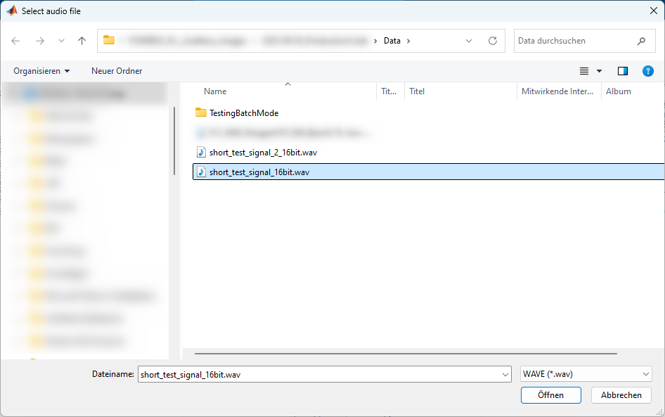

**WORK IN PROGRESS**

# Documentation on how to use AudiImage <!-- omit in toc -->

## Table of Contents <!-- omit in toc -->
<!-- TOC -->

- [First time installation \& Update](#first-time-installation--update)
- [Usage](#usage)
  - [Compute a SAI](#compute-a-sai)
    - [Configure `ParametersToComputeSai.m`](#configure-parameterstocomputesaim)
      - [`%% Path settings`](#-path-settings)
      - [`%% SAI compute and process options`](#-sai-compute-and-process-options)
    - [Run `RunComputationOfSai.m`](#run-runcomputationofsaim)
    - [SAI Dataset in `[pathToResults]`](#sai-dataset-in-pathtoresults)
  - [Process a SAI](#process-a-sai)
    - [Configure `ParametersToProcessSai.m`](#configure-parameterstoprocesssaim)
      - [`%% Path settings`](#-path-settings-1)
      - [`%% SAI process options`](#-sai-process-options)
    - [Run `RunProcessingOfSai.m`](#run-runprocessingofsaim)
    - [processed SAI Dataset in `[pathToResults]`](#processed-sai-dataset-in-pathtoresults)
  - [Analyze a SAI with ShowSAI](#analyze-a-sai-with-showsai)
    - [optional: Configure `ParametersToShowSai.m`](#optional-configure-parameterstoshowsaim)
      - [`%% Path settings`](#-path-settings-2)
    - [analyzed SAI Dataset in `[pathToResults]`](#analyzed-sai-dataset-in-pathtoresults)
- [Demo and test files for quick hands-on](#demo-and-test-files-for-quick-hands-on)
  - [`docs/demo/`](#docsdemo)
  - [`docs/test/`](#docstest)

<!-- /TOC -->


## First time installation & Update

An installation and update procedure is described in a separate document
[here](../docs/INSTALLATION_NOTES.md).


## Usage

> **Congrats! You are reading the docs!** This is now what you get (refer to the
> flow chart below, which you might have seen already in the main `README`):
> 1. We will explore the "Compute a SAI" path.
> 2. Then "Process a SAI" will be discovered.
> 3. And finally the "ShowSAI" app will be highlighted.


### Compute a SAI

| Step | File/Folder | Description |
| -: | :- | :- |
| **1.** | `ParametersToComputeSai.m` | **Edit this file to configure/parameterize the computation of auditory images.** Below you'll find a comprehensive description of all parameters. |
| **2.** | `RunComputationOfSai.m` | **Just run this script to perform the computation of auditory images.** This script mainly collects audio file(s) and calls then `script/ComputeSai()` for each file to perform SAI computation. |
| **3.** | SAI Dataset in `[pathToResults]` | **You'll find the results in this folder, also called SAI Dataset.** A hard-coded subfolder structure holds the `MAT` files for SAI, cochleagram and pitchogram and a copy of the inputed audio file(s). A so-called **summary file**, which is located in the root folder, is saved for each SAI (as `MAT` file). This summary file is basically needed then for further steps of processing and analyzing the SAI. |


#### Configure `ParametersToComputeSai.m`

##### `%% Path settings`

Here you set, where the inputed audio file(s) are located:

```matlab
basePathToData = 'C:\Base\Path\To\Data';
pathToAudioFile = fullfile(basePathToData, 'Relative\Path\To\AudioFile');
```

- Basically only `pathToAudioFile` is processed by `RunComputationOfSai.m`.
- Reason to have `basePathToData` is, that audio files might be located in a
  subfolder structure in this given base path and you want to "switch" with a
  relative path in `pathToResults` between these.
- You are free to use the above logic or just enter the full path to
  `pathToAudioFile` and ignore `basePathToData`.


Next is to define, where the results have to be stored:

```matlab
basePathToResults = 'C:\Base\Path\To\Results';
pathToResults = fullfile(basePathToResults, 'Relative\Path\To\Results');
```

- Here the same applies: Basically only `pathToResults` is processed by
  `RunComputationOfSai.m`.
- `basePathToResults` might be used for a common results location, where in a
  subfolder structure different results are stored and you want to "switch" with
  a relative path in `pathToResults` between these.
- Feel free to use either the proposed logic with the `basePathToResults` or
  just enter the full path to `pathToResults` and ignore `basePathToResults`.


##### `%% SAI compute and process options`

As we are here to explain SAI computation, only `computeOptions` struct is
explained. `processOptions` struct is then shown in [Process a
SAI](#process-a-sai) section.

```matlab
isBatchMode = false;
```
- `true`:  Selection of multiple files or a whole folder is possible.
- `false`: Only one single file could be selected and processed.


```matlab
isProcessSaiAfterComputation = false;
```
- `true`:  After computation of auditory images the processing stage is called.
- `false`: Only computation of auditory images is done.


```matlab
computeOptions.isWavFile32bitIEEEFloatFormat = false;
```
- `false`: WAV 16 bit Integer (= values show no meaning of sound pressure)
- `true`:  WAV 32 bit IEEE Float (= real sound pressure values)

  > **Note:** Of course, it is possible, to use other formats than WAVE! For all
  > those formats `false` has to be chosen. WAVE format has the possibility, if
  > it is IEEE FLOAT format, that real sound pressure values are stored.


```matlab
computeOptions.isDisplaySaiDuringComputation = false;
```
- `true`:  The currently computed SAI segment is shown live.
- `false`: Shorter compute time w/o live figure (default).


```matlab
computeOptions.isConvertStereoToMono = false;
```
- `true`:  If input signal is stereo, conversion to mono signal is done.
- `false`: Choose if either mono signal or multiple channels are present (default).

  > **Note:** You can choose either stereo to mono conversion or extract a
  > channel from audio signal. Both is not possible.
  > If `computeOptions.isConvertStereoToMono = true` then
  > `computeOptions.CHANNEL_FROM_AUDIO_SIGNAL_TO_EXTRACT` is ignored.


```matlab
computeOptions.CHANNEL_FROM_AUDIO_SIGNAL_TO_EXTRACT = 1;
```
- Choose here the channel to be extracted from in audio file for SAI
  computation.

  > **Note:** If `computeOptions.isConvertStereoToMono = true` then
  > `computeOptions.CHANNEL_FROM_AUDIO_SIGNAL_TO_EXTRACT` is ignored.


```matlab
computeOptions.DURATION_IN_SECONDS_TO_PAD_AUDIO_SIGNAL = 0;
```
- `0`:  SAI movie ends when audio file ends (default).
- Choose a positive float value in seconds, to avoid abrupt end of SAI movie.
  Recommendation is something between `0.5` and `1.0`.


```matlab
computeOptions.REDUCTION_OF_FULL_SCALE_AMPLITUDE_IN_dB = -30;
```
- If `computeOptions.isWavFile32bitIEEEFloatFormat = false` choose here a
  reduction in dB of full scale amplitude. Otherwise this variable is ignored.
- Recommendation is `-30` or `-40`.


```matlab
computeOptions.SCALE_FACTOR_TO_CONVERT_REAL_SOUND_PRESSURE = 2;
```
- If `computeOptions.isWavFile32bitIEEEFloatFormat = true` choose here a factor
  by which real sound pressure values are divided.
- `2` would be the factor to choose:
  > **Note:** If WAV file is 32 bit IEEE Float format the values represent then
  > the original sound pressure values. Here is the reply from Dick to the
  > question how to scale:
  > > I usually say the scaling is that 1.0 in corresponds to about
  > > 100 dB SPL (2 Pa), but it's not really calibrated. I just looked up
  > > what I did for Figure 17.3, and found 1e-5 corresponds to 0 dB SPL
  > > there, so that would be right.


#### Run `RunComputationOfSai.m`

When `ParametersToComputeSai.m` is appropriately parameterized then just run the
script `RunComputationOfSai.m` with MATLAB:


It could happen that a message pops up from the MATLAB Editor which states that
`.../RunComputationOfSai.m` is not found in the current folder or in the MATLAB
path. Please click on the button "Change Folder", as shown in the screenshot to
proceed:


If `isBatchMode = true` then you will be faced with an options dialogue, where
you have to select if you want choose multiple audio files or a whole folder
with audio files:


Anyways you will be then confronted with an open file or folder dialogue
(here shown: single file selection):



Then there will be at least two progress bars visible, one to show overall
progress (especially relevant when multiple files are chosen), the other to show
the current progress of SAI computation:


In the meantime MATLAB's command window will be very verbose and tells you what
is currently going on:


You'll get even more entertainment if
`computeOptions.isDisplaySaiDuringComputation = true` is set. Then you can see
in a MATLAB figure the current SAI movie frame:


When computation run is finished you'll get a message box with the runtime:


#### SAI Dataset in `[pathToResults]`

AudiImage generates a hard-coded subfolder structure in a given `pathToResults`
folder. The subfolder structure is shown in the following scheme.

```text
[pathToResults]/
    │
    ├── Audio/
    │   [audio-filename].[audio-filetype]
    │
    ├── Cochleagram/
    │   [audio-filename]_Cochleagram.mat
    │   [audio-filename]_MovieCochleagram.mat
    │
    ├── Pitchogram/
    │   [audio-filename]_Pitchogram.mat
    │   [audio-filename]_MoviePitchogram.mat
    │
    ├── SAI/
    │   [audio-filename]_SAI.mat
    │
    [audio-filename]_Summary.mat    # Summary file
```

- The generated `MAT` files are saved with the `'-v7.3'` option.
- All filenames start with the filename of the inputed audio file.
- The content of the `MAT` files is described by an descriptive suffix.
  Additionally they are structured in subfolders.
- Not shown but there might be (depending on computation parameters) the
  `computeOptions.REDUCTION_OF_FULL_SCALE_AMPLITUDE_IN_dB` included in the
  filename.
- Not shown in above scheme but there is for every computation run always a
  report file generated which is named `RuntimeStatistics_[timestamp].xlsx`
  (`[timestamp]` has the format `yyyyMMdd_HHmmss`).


### Process a SAI

| Step | File/Folder | Description |
| -: | :- | :- |
| **1.** | `ParametersToProcessSai.m` | **Edit this file to configure/parameterize the processing of an existing SAI dataset.** Below you'll find a comprehensive description of all parameters. |
| **2.** | `RunProcessingOfSai.m` | **Just run this script to perform the processing of a SAI dataset.** This script mainly collects summary file(s) and calls then `script/ProcessSai()` for each file to perform SAI processing. |
| **3.** | processed SAI Dataset in `[pathToResults]` | **You'll find the results of the processed SAI Datset in the corresponding subfolders.** Depending on the parameters set these are mainly `PNG` files of cochleagram and pitchogram and `MPG`/`MP4` files with the SAI movies. |


#### Configure `ParametersToProcessSai.m`

##### `%% Path settings`

Set here, where the results have been stored:

```matlab
basePathToResults = 'C:\Base\Path\To\Results';
pathToResults = fullfile(basePathToResults, 'Relative\Path\To\Results');
```

- Again, basically only `pathToResults` is processed by `RunProcessingOfSai.m`.
- `basePathToResults` might be used for a common results location, where in a
  subfolder structure different results are stored and you want to "switch" with
  a relative path in `pathToResults` between these.
- Feel free to use either the proposed logic with the `basePathToResults` or
  just enter the full path to `pathToResults` and ignore `basePathToResults`.


##### `%% SAI process options`

```matlab
isBatchMode = false;
```
- `true`:  Selection of multiple summary files or a whole folder is possible.
- `false`: Only one single summary file could be selected and processed.


```matlab
processOptions.NAME_OF_COLORMAP = 'turbo';
```
- Choose here the colormap how the above images and movies should be colorized.
- Possible values are: `'parula'`, `'turbo'`, `'hsv'`, `'hot'`, `'cool'`,
  `'spring'`, `'summer'`, `'autumn'`, `'winter'`, `'gray'`, `'bone'`,
  `'copper'`, `'pink'`, `'jet'`, `'grayInverted'` (which is `flip(gray)`) and
  `'analyzer'` (a custom colormap similar to `'turbo'` and `'jet'`).


```matlab
processOptions.isProcessCochleagram = true;
processOptions.isProcessPitchogram = true;
```
- `true`:  `PNG` files of complete cochleagram and/or pitchogram are generated. For the pitchogram there are two images generated, where the lag axis is for one on the x-axis, for the other on the y-axis located.
- `false`: No processing.
- Examples:
  
  
  
  


```matlab
processOptions.isProcessMovieWithComposedImage = true;
```
- `true`:  `MPG` and `MP4` files of the SAI movie with a composed image are
  generated. This is the movie type from the original implementation where the
  SAI with its derived components is dumped to one single frame. The cochleagram
  is at the top, the SAI is located in the center and in the lower part the
  pitchogram is seen. Additionally there is a `ZIP` file, which contains all
  frames of the movie as `PNG` files.
- `false`: No processing.
- Example:

  

  > **Remark:** The original implementation generated movie files only to `MPG`
  > format (Video: mpeg1video, Audio: mp2). We tried direct generation to `MP4`
  > format (Video: h264 & Audio: aac), but we were not able to realize that
  > (video stream was always corrupted). Therefore there is a conversion of the
  > `MPG` movie file to a `MP4` file, while retaining the `MPG` file. Reason
  > to have `MP4` format is the seemless import to PowerPoint.

```matlab
processOptions.isProcessMovieWithMovieGrams = false;
processOptions.isProcessMovieWithCompleteGrams = false;
```
- `true`:  `MPG` and `MP4` files of the SAI movie with full-fledged figures are
  generated. For cochleagram and pitchogram are either the representations from
  the composed image used, this is meant with `"MovieGrams"`, or the complete
  versions are displayed, this is meant with `"CompleteGrams"`. Additionally
  there is a `ZIP` file for each movie, which contains all frames of the movies
  as `PNG` files.
- `false`: No processing.

  
  

  > **Note:** If this options are chosen processing requires a long time!
  
  > **Remark:** Reason to have two movie file formats is same as outlined with
  > the composed image movie, see one above!


```matlab
processOptions.isProcessSpectrogram = false;
processOptions.SPECTROGRAM_TYPE_OF_WINDOW = 'hann';
processOptions.SPECTROGRAM_NUMBER_OF_DFT_POINTS = 2048;
processOptions.SPECTROGRAM_WINDOW_OVERLAP_IN_PERCENT = 50;
```
- `true`:  `PNG` files of a spectrogram of the corresponding audio file is
  generated. There is one with logarithmic frequency axis, the other has a
  linear axis. Set parameters for spectrogram computation appropriately.
- `false`: No processing.

- Examples:

  
  

  > **Note:** MATLAB's Signal Processing Toolbox is needed for this option!


#### Run `RunProcessingOfSai.m`

When `ParametersToProcessSai.m` is appropriately parameterized then just run the
script `RunProcessingOfSai.m` with MATLAB:


It could happen that a message pops up from the MATLAB Editor which states that
`.../RunProcessingOfSai.m` is not found in the current folder or in the MATLAB
path. Please click on the button "Change Folder", as shown in the screenshot to
proceed:


If `isBatchMode = true` then you will be faced with an options dialogue, where
you have to select if you want choose multiple summary files or a whole folder
with summary files:


Anyways there will be an open file or folder dialogue (here shown: single file
selection):


Then there will be at least two progress bars visible, one to show overall
progress (especially relevant when multiple files are chosen), the other to show
the current progress of SAI processing (this second progress bar will displayed
several times, depending on configured process parameters):


In the meantime MATLAB's command window will be very verbose and tells you what
is currently going on:


There will be popping up several windows with figures, depending on configured process parameters:


When processing run is finished you'll get a message box with the runtime:


#### processed SAI Dataset in `[pathToResults]`

Depending on configured process parameters there will added some new subfolders
(`Movie` and `Spectrogram`) and all the processed images and/or movies are saved
there accordingly. The subfolder structure is shown in the following scheme
(only the newly added files are shown!).

```text
[pathToResults]/
    │
    ├── Audio/
    │
    ├── Cochleagram/
    │   [audio-filename]_Cochleagram_[NAME_OF_COLORMAP].png
    │
    ├── Movie/
    │   [audio-filename]_[NAME_OF_COLORMAP]_CompleteGrams.mp4
    │   [audio-filename]_[NAME_OF_COLORMAP]_CompleteGrams.mpg
    │   [audio-filename]_[NAME_OF_COLORMAP]_CompleteGrams.zip
    │   [audio-filename]_[NAME_OF_COLORMAP]_ComposedImage.mp4
    │   [audio-filename]_[NAME_OF_COLORMAP]_ComposedImage.mpg
    │   [audio-filename]_[NAME_OF_COLORMAP]_ComposedImage.zip
    │   [audio-filename]_[NAME_OF_COLORMAP]_MovieGrams.mp4
    │   [audio-filename]_[NAME_OF_COLORMAP]_MovieGrams.mpg
    │   [audio-filename]_[NAME_OF_COLORMAP]_MovieGrams.zip
    │
    ├── Pitchogram/
    │   [audio-filename]_Pitchogram_[NAME_OF_COLORMAP]_LagOnXAxis.png
    │   [audio-filename]_Pitchogram_[NAME_OF_COLORMAP]_LagOnYAxis.png
    │
    ├── SAI/
    │
    └── Spectrogram/
        [audio-filename]_Spectrogram_[NAME_OF_COLORMAP]_LinYAxis.png
        [audio-filename]_Spectrogram_[NAME_OF_COLORMAP]_LogYAxis.png
```

- All filenames start with the filename of the inputed audio file.
- The content of the processed files (`PNG`, `MPG`, `MP4`, `ZIP`) is described
  by an descriptive suffix.
- Not shown but there might be (depending on computation parameters) the
  `computeOptions.REDUCTION_OF_FULL_SCALE_AMPLITUDE_IN_dB` included in the
  filename.
- Not shown in above scheme but there is for every processing run always a
  report file generated which is named `RuntimeStatistics_[timestamp].xlsx`
  (`[timestamp]` has the format `yyyyMMdd_HHmmss`).


### Analyze a SAI with ShowSAI

This is the final crown of AudiImage: An MATLAB app to show and analyze SAI
datasets in detail (in short called "ShowSAI"). Advantage is, that you don't have to process a SAI dataset, you just open a summary file and all results are available in one go. Just try out, most of the UI should be self explaining:


- Main purpose to to analyze a SAI segment by segment.
- You can have multiple instances of ShowSAI.
- You can change different stuff ad-hoc, like the colormap or the upper bound of
  some axis.
- Recalculate the "movie" pitchogram to have smaller or bigger stretch area or
  change the duration different from the default value.
- You can export the current analysis to a `PNG` file:

  
- There is also a separate window, where you can adjust the current segment in
  size, e.g., for publication or presentation purposes:

  
  


#### optional: Configure `ParametersToShowSai.m`

##### `%% Path settings`

This configuration is fully optional, but helps avoiding frustration when
working for a longer period in the same folder: Just set here, where the results
have been stored:

```matlab
basePathToResults = 'C:\Base\Path\To\Results';
subfolderToResults = 'Results';
```

- This time it is necessary to parameterize both variables as both are processed
  by `ShowSai.mlapp`.
- `basePathToResults` is used for a common results location, where in a
  subfolder structure different results are stored.
- You "switch" via a relative path in `pathToResults` between these.


#### analyzed SAI Dataset in `[pathToResults]`

When analyzing a SAI Dataset with the ShowSAI app and saving current segments
there will be a new subfolder in `[pathToResults]` called `Analysis` which holds
all analysis results in corresponding subfolder. The subfolder structure is
shown in the following scheme.

```text
[pathToResults]/
    │
    ├── Analysis/
    │   ...
    │
    ├── Audio/
    │
    ├── Cochleagram/
    │
    ├── Pitchogram/
    │
    └── SAI/
```

- All filenames start with the filename of the inputed audio file.
- The content of the analyzed files (`PNG`) is described by an descriptive
  suffix.
- Not shown but there might be (depending on computation parameters) the
  `computeOptions.REDUCTION_OF_FULL_SCALE_AMPLITUDE_IN_dB` included in the
  filename.


## Demo and test files for quick hands-on

[Our paper][kuka-fischer-link][^kuka-fischer-reference] describes in Fig. 2 and
3 some basic stimuli, which demonstrate the remarkable abilities of auditory
images. These audio files are made available here as demo files. Additionally,
some more related demo files are provided which differ in either the carrier
frequency or the evoking roughness sensation frequency. Just explore!

There are two more test files provided, which were used in development of
AudiImage for different purposes and for generating images for documentation.
Feel free to use them if needed.


### `docs/demo/`
| File | Remarks |
| :- | :- |
| `sine_AM_stationary_500Hz_70Hz_1Pa_ShortSignal_PinkNoise_FullScale_20ms_16bit.wav` | 3x sine with carrier @ 0.5k Hz + roughness sensation @ 70 Hz |
| `sine_AM_stationary_1kHz_35Hz_1Pa_ShortSignal_PinkNoise_FullScale_20ms_16bit.wav` | 3x sine with carrier @ 1k Hz + roughness sensation @ 35 Hz |
| `sine_AM_stationary_1kHz_70Hz_1Pa_ShortSignal_PinkNoise_FullScale_20ms_16bit.wav` | 3x sine with carrier @ 1k Hz + roughness sensation @ 70 Hz, refer to Fig. 3. |
| `sine_AM_stationary_1kHz_140Hz_1Pa_ShortSignal_PinkNoise_FullScale_20ms_16bit.wav` | 3x sine with carrier @ 1k Hz + roughness sensation @ 140 Hz |
| `sine_AM_stationary_4kHz_70Hz_1Pa_ShortSignal_PinkNoise_FullScale_20ms_16bit.wav` | 3x sine with carrier @ 4k Hz + roughness sensation @ 70 Hz |
| `sine_stationary_500Hz_1Pa_ShortSignal_PinkNoise_FullScale_20ms_16bit.wav` | 3x sine with 0.5k Hz. |
| `sine_stationary_1kHz_1Pa_ShortSignal_PinkNoise_FullScale_20ms_16bit.wav` | 3x sine with 1k Hz, refer to Fig. 2. |
| `sine_stationary_4kHz_1Pa_ShortSignal_PinkNoise_FullScale_20ms_16bit.wav` | 3x sine with 4k Hz. |


### `docs/test/`

| File | Remarks |
| :- | :- |
| `short_test_signal_16bit.wav` | Three tones, short signal of 1 s. Main purpose: Testing. |
| `short_test_signal_2_16bit.wav` | There is an impulsive component with a repetition frequency of 1 s. Watch for this in SAI and pitchogram! |


<!-- Link shorteners and footnotes -->

[kuka-fischer-link]: https://pub.dega-akustik.de/DAGA_2024/files/upload/paper/44.pdf

[^kuka-fischer-reference]: M. Kuka and M. Fischer, “Hearing Equivalent Signal Analysis by Auditory Images in Industrial Applications,” in Fortschritte der Akustik - DAGA 2024, Hannover, Mar. 2024, pp. 1218–1221. [Online]. Available: https://pub.dega-akustik.de/DAGA_2024/files/upload/paper/44.pdf